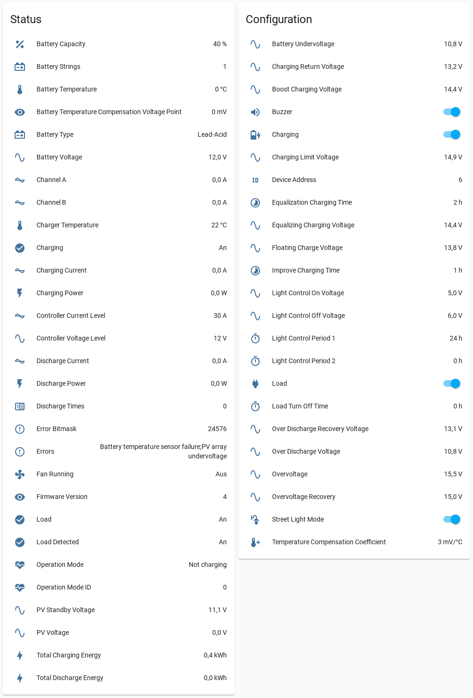

# esphome-jnge-mppt-controller


[](https://www.buymeacoffee.com/syssi)

ESPHome component to monitor and control a JN-MPPT or JN-W/S Controller via RS485



## Supported devices

* JN-MPPT-MINI Buck Solar Charge Controller
* JN-MPPT-AL Buck Solar Charge Controller
* JN-MPPT-BL Buck Solar Charge Controller
* JN-MPPT-CL Buck Solar Charge Controller
* JN-12-W300/S300, JN-12-W500/S500 Wind and Solar Hybrid Controller
* JN-24-W600/S600, JN-24-W800/S800 Wind and Solar Hybrid Controller
* JN-48-W800/S800, JN-48-W1000/S1000 Wind and Solar Hybrid Controller

## Requirements

* [ESPHome 2022.2.0 or higher](https://github.com/esphome/esphome/releases).
* One half of an ethernet cable with rj45 connector
* RS485-to-TTL module (`HW-0519` f.e.)
* Generic ESP32 or ESP8266 board

## Schematics

<a href="https://raw.githubusercontent.com/syssi/esphome-jnge-mppt-controller/main/images/circuit.jpg" target="_blank">

</a>

```
                  RS485                      UART
┌────────────┐              ┌──────────┐                ┌─────────┐
│            │              │          │<----- RX ----->│         │
│    JNGE    │<-----B- ---->│  RS485   │<----- TX ----->│ ESP32/  │
│ Controller │<---- A+ ---->│  to TTL  │<----- GND ---->│ ESP8266 │
│            │<--- GND ---->│  module  │<--- 5V VCC --->│         │<-- 5V VCC
│            │              │          │                │         │<-- GND
└────────────┘              └──────────┘                └─────────┘

```

### RJ45 jack

| Pin     | Purpose      | RS485-to-TTL pin  | Color T-568B |
| :-----: | :----------- | :---------------- | ------------ |
|  **1**  | **B-**       | **B-**            | Orange-White |
|    2    | B-           |                   |              |
|  **3**  | **A+**       | **A+**            | Green-White  |
|    4    | A+           |                   |              |
|  **5**  | **GND**      | **GND**           | Blue-White   |
|    6    | GND          |                   |              |
|    7    | +12V         |                   | Brown-White  |
|    8    | +12V         |                   |              |

Please be aware of the different RJ45 pinout colors ([T-568A vs. T-568B](images/rj45-colors-t568a-vs-t568.png)).

If the device supports some load (untested!) at pin 7/8 it could be used to power the ESP. A buck converter from 12V to 5V is required in this case.


## Setup

* [JN-MPPT Buck Solar Charge Controller](jnge_mppt_controller.md)
* [JN-W/S Wind and Solar Hybrid Controller](jnge_wind_solar_controller.md)

## References

* JNGE MPPT Controller Internal Communication Proto.pdf
* [JNGE Wind and Solar Hybrid Controller Internal Communication Proto.pdf](https://github.com/syssi/esphome-jnge-mppt-controller/files/8106839/JNGE.Wind.and.Solar.Hybrid.Controller.Internal.Co.pdf)
